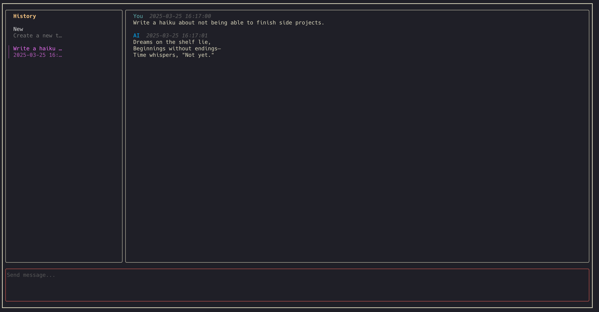

## Panda

A terminal user interface for chatting with LLMs. 

I started this project because I wanted something lightweight that I can run in my terminal to talk with LLMs.
I could not keep up the project with my work and the everchanging landscape of LLMs and their capabilities. I also realized that the terminal is not the right interface for this kind of thing.

However, I had to finish this and get a v0 out (have a bad habit of not being able to move on to a new side-project otherwise). Right now it can only talk to OpenAI's API (you need an OpenAI API Key) and is very basic in features.

### Usage

Install with `go install github.com/aavshr/panda@latest` and run with `panda`. 

Clone the repository and build with `make build` if you just want to build it yourself.

**Navigation**

- `Esc` to focus out of a section
- `Enter` to focus into a section
- Use arrow keys or `hjkl` to navigate

**Chat**

- Use `Tab` to send a message

**History**

- Use `Enter` to start a new chat in that thread
- Use `Ctrl + D` to delete a thread 
- Use `/` to filter threads
